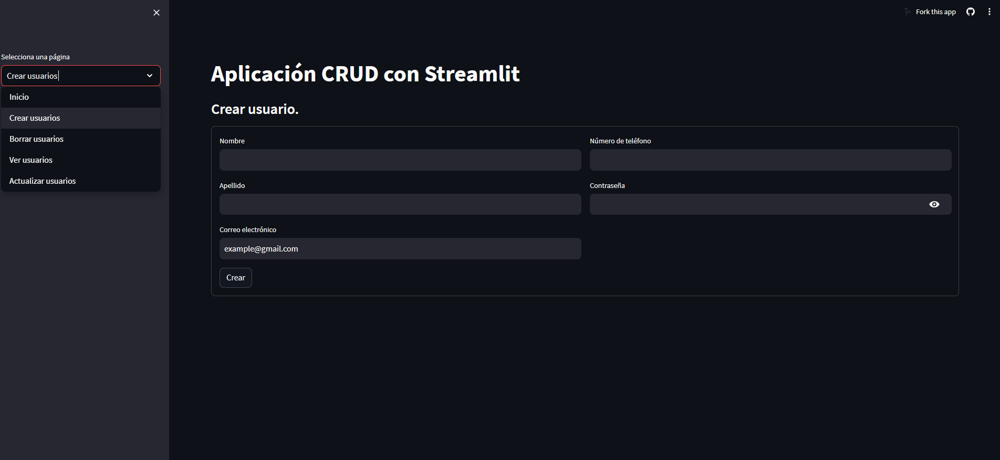

# CRUD App
## Descripción
Aplicación CRUD para la gestión de datos de una base de datos de usuarios. La aplicación permite crear, leer, actualizar y eliminar usuarios de la base de datos. La aplicación está desarrollada en Python y utiliza la librería Streamlit para la creación de la interfaz gráfica. La base de datos utilizada es SQLite.
## Instalación
Para instalar las dependencias del proyecto, ejecutar el siguiente comando:
```bash
pip install -r requirements.txt
```
## Ejecución
Para ejecutar la aplicación, ejecutar el siguiente comando:
```bash
streamlit run app.py
```
## Uso
La aplicación permite crear, leer, actualizar y eliminar usuarios de la base de datos. Para crear un usuario, se debe ingresar el nombre, apellido y edad del usuario y presionar el botón "Crear". Para leer un usuario, se debe ir a la sección ver usuarios. Para actualizar un usuario, se debe ingresar el id del usuario, el nombre, apellido y edad del usuario y presionar el botón "Actualizar". Para eliminar un usuario, se debe ingresar el id del usuario y presionar el botón "Eliminar".
## Vista previa


Link a la app:
https://crudapp-cndqxe2qrb4cwgj5cyvfck.streamlit.app/